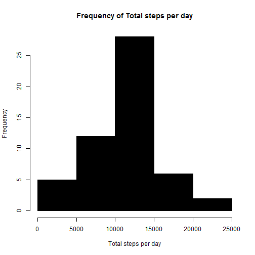
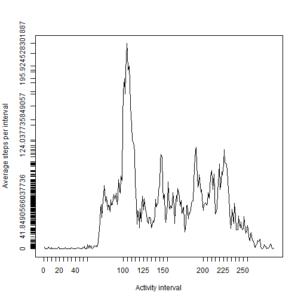
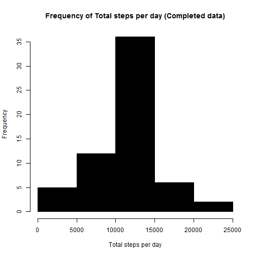

## Analysis of Activity monitoring Data


The following report analyzes data from an Activity monitoring device, The variables included in this dataset are:

   steps: Number of steps taking in a 5-minute interval (missing values are coded as NA)
    date: The date on which the measurement was taken in YYYY-MM-DD format
interval: Identifier for the 5-minute interval in which measurement was taken

The dataset is stored in a comma-separated-value (CSV) file and there are a total of 17,568 observations in this dataset.

The report attempts to address the following questions:

1. Frequency of "Total Steps per day""

2. Average Total Steps per day 

3. Median Total Steps per day

4. Average activity pattern per day

5. Average Steps per Interval across days

6. Interval with Maximum Activity (maximum average steps per interval over days)

7. Total number of missing values in Data

8. Treatment of missing data with simulation values

9. Average Total Steps per day with complete data

10. Average Total Steps per day with complete data

11. Median Total Steps per day with complete data

12. Average/Median Difference of Total Steps per day between Incomplete and Complete data

### 1. Frequency of "Total Steps per day"


```r
 library(reshape2)

 raw = read.csv("activity.csv")

 #find complete cases index
 ix = complete.cases(raw)

 #get complete records 
 activity = raw[ix,]
 
 #reshape data by date and interval where steps as measurement
 melted = melt(activity, id=c("date", "interval"), measure.vars=c("steps"))
 
 #total steps per day, cast as sum of steps per day by date 
 totalStepsPerDay = dcast(melted, date ~ variable, sum) 

 hist(totalStepsPerDay$steps, col=1, main="Frequency of Total steps per day", xlab="Total steps per day") 
```

 
 
### 2. Average Total Steps Per day: 

```r
meanTotalStepsPerDay = mean(totalStepsPerDay$steps)
meanTotalStepsPerDay
```

```
## [1] 10766.19
```

### 3. Median Total Steps Per day:

```r
medianTotalStepsPerDay = median(totalStepsPerDay$steps) 
medianTotalStepsPerDay
```

```
## [1] 10765
```
 
### 4. Average Steps Per Interval 

```r
#mean steps per interval
meanStepsPerInterval = dcast(melted, interval ~ variable, mean)
```

```r
plot( meanStepsPerInterval$steps,  type="l", ann=FALSE, axes=FALSE)
axis(1,at=meanStepsPerInterval$interval, lab=meanStepsPerInterval$interval)
axis(2,at=meanStepsPerInterval$steps, lab=meanStepsPerInterval$steps)
title(ylab="Average steps per interval")
title(xlab="Activity interval")
box()
```

 

### 5. Interval with Maximum Activity (maximum average steps per interval over days)

```r
 # max interval index
 maxIntervalIndex = meanStepsPerInterval$steps==max(meanStepsPerInterval$steps)
 
 # the interval with maximum mean steps
 maxMeanStepsInterval = meanStepsPerInterval[maxIntervalIndex,]$interval   
 maxMeanStepsInterval
```

```
## [1] 835
```
### 6. Total number of missing values in Data

```r
 # get index of incomplete values
 naix = is.na(raw)
 incomplete = raw[naix,]
 nrow(incomplete)
```

```
## [1] 2304
```
### 7. Treatment of missing data with simulation values, 
       simulation value used to populate missing steps is Average steps per Interval over days
       

```r
#find matching interval index in meanStepsPerInterval data frame
matchingix = match(incomplete$interval, meanStepsPerInterval$interval)

complete = raw
#fill missing steps for given interval by corresponding mean steps for that interval
complete[naix,]$steps = meanStepsPerInterval[matchingix,]$steps

#incomplete data subset as sample
head(raw[naix,])
```

```
##   steps       date interval
## 1    NA 2012-10-01        0
## 2    NA 2012-10-01        5
## 3    NA 2012-10-01       10
## 4    NA 2012-10-01       15
## 5    NA 2012-10-01       20
## 6    NA 2012-10-01       25
```

```r
#complete data subset as sample
head(complete[naix,])
```

```
##       steps       date interval
## 1 1.7169811 2012-10-01        0
## 2 0.3396226 2012-10-01        5
## 3 0.1320755 2012-10-01       10
## 4 0.1509434 2012-10-01       15
## 5 0.0754717 2012-10-01       20
## 6 2.0943396 2012-10-01       25
```
### 8.Average Total Steps Per day with Treated complete data

```r
 #reshape data by date and interval where steps as measurement
 melted2 = melt(complete, id=c("date", "interval"), measure.vars=c("steps"))
 
 #total steps per day, cast as sum of steps per day by date 
 totalStepsPerDay2 = dcast(melted2, date ~ variable, sum) 

 hist(totalStepsPerDay2$steps, col=1, main="Frequency of Total steps per day (Completed data)", xlab="Total steps per day" ) 
```

 

### 10. Average Total Steps per day with complete data

```r
meanTotalStepsPerDay2 = mean(totalStepsPerDay2$steps)
meanTotalStepsPerDay2
```

```
## [1] 10766.19
```

### 11. Median Total Steps per day with complete data

```r
medianTotalStepsPerDay2 = median(totalStepsPerDay2$steps) 
medianTotalStepsPerDay2
```

```
## [1] 10766.19
```
### 12. Average/Median Difference of Total Steps per day between Incomplete and Complete data
    No difference observed between Average, however difference of 1.19 observed in Median values of Total steps per       day between incomplete and complete data
    

```r
meanDiff = meanTotalStepsPerDay2 - meanTotalStepsPerDay
meanDiff
```

```
## [1] 0
```

```r
medianDiff = medianTotalStepsPerDay2 - medianTotalStepsPerDay
medianDiff
```

```
## [1] 1.188679
```

